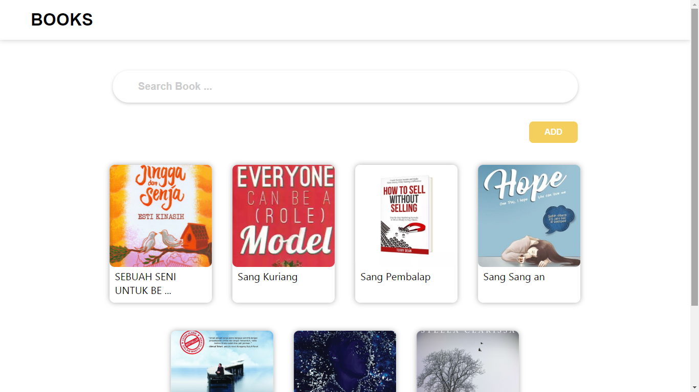

<h1 align="center">Simple Book Management</h1>

  

## Table of Contents

- [Features](#features)
- [Screenshoot](#screenshoot)
- [Requirements](#requirements)
- [Usage](#usage-for-development)
- [Related Project](#related-project)
- [License](#license)

## Introduction
Simple Book Management to make online book loan transactions based on Web. There are several books with famous authors and can read a brief synopsis by looking at the details of the book

The purpose of this application is for people to borrow books online and easily

## Features
* Users can Add, Remove Or delete  book
* Search book with title 
* Login
* Register
* And others
## Screenshoot

    
    

## Requirements
* [`npm`](https://www.npmjs.com/get-npm)
* [`react-js`](https://reactjs.org/docs/getting-started.html)
* [`axios`](https://github.com/axios/axios)

## Usage for development
1. Open your terminal or command prompt
2. Type `git clone https://github.com/zidni0192/front-End-Week6`
3. Open the folder and type `npm install` for install dependencies 
4. Type `npm start ` for run this app.

## Related Project
<a href ='https://github.com/zidni0192/back-End-Week6'>Back End Book Management</a>

### License
[Beerware](https://en.wikipedia.org/wiki/Beerware "Beerware") © [Zidni](https://github.com/zidni0192 "Zidni")